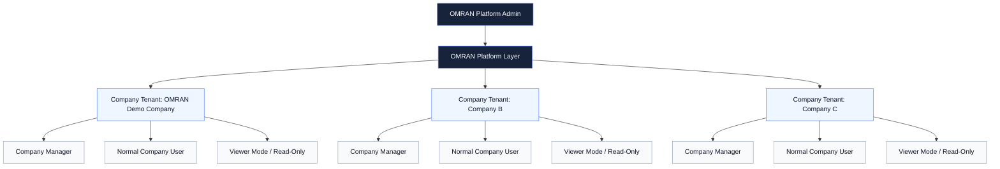
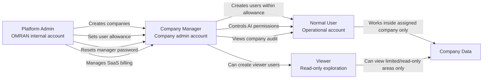
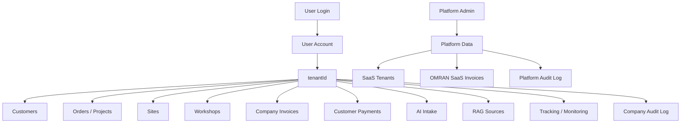
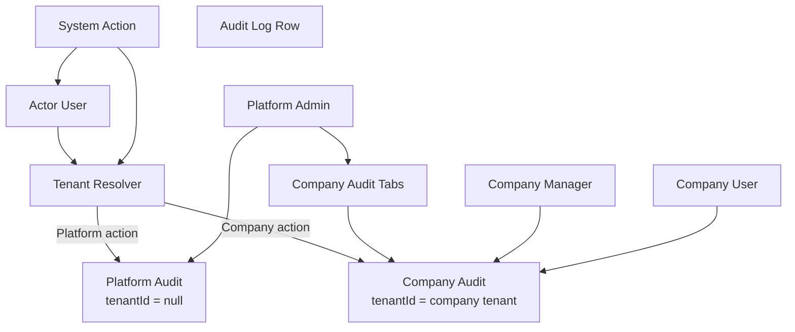
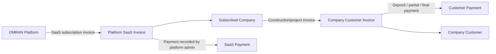
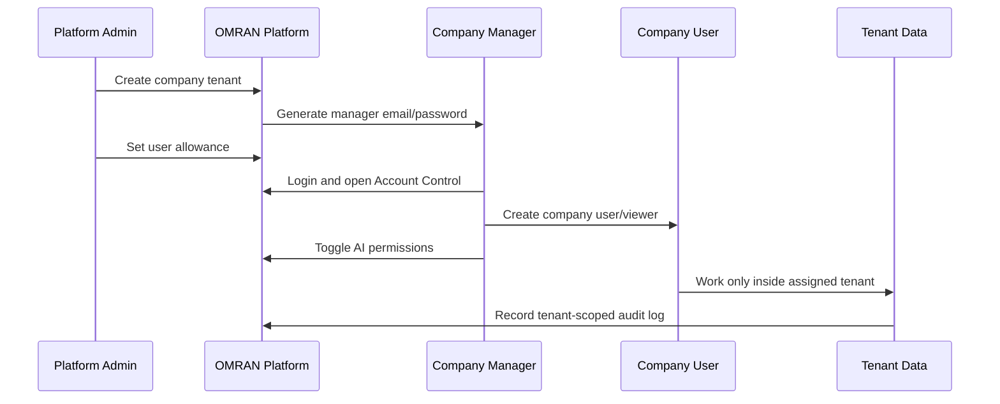

# OMRAN Multi-Tenancy And Roles Architecture

This document explains how the current OMRAN system is structured for platform administration, company-level management, normal users, viewer access, and isolated company data.

## 1. High-Level Multi-Tenant Architecture

**Meaning:** OMRAN owns the platform. Each subscribed company is a separate tenant. Company data must stay inside its own tenant and must not appear inside another company account.

## 2. Role Hierarchy And Responsibility

## 3. Access Control Matrix

| Capability | Platform Admin | Company Manager | Normal User | Viewer |
|---|---:|---:|---:|---:|
| Create subscribed companies | Yes | No | No | No |
| Generate/reset company manager password | Yes | No | No | No |
| Set company user limit | Yes | No | No | No |
| Manage platform SaaS invoices | Yes | No | No | No |
| View platform audit log | Yes | No | No | No |
| Create company users | No | Yes, within limit | No | No |
| Change own password | Yes | Yes | Yes | If registered viewer, yes |
| Manage company invoices | No | Yes | Permission-based | Read-only/no |
| Use AI Intake | No by default | Yes | Permission-based | No |
| Use RAG knowledge | No by default | Yes | Permission-based | No |
| Use AI Monitoring | No by default | Yes | Permission-based | No |
| Add/edit project tracking | No | Yes | Permission-based | No |
| Upload photos | No | Yes | Permission-based | No |
| View company audit log | Company tab only | Own company only | If permitted | No |

## 4. Tenant Data Isolation

**Rule:** Company data is filtered by `tenantId`. Platform admin data is separated from company data. Platform audit and company audit should not be mixed.

## 5. Audit Log Isolation

**Meaning:**  
Platform admin can see platform audit and can open a specific company audit tab. Company managers and users only see audit events for their own company.

## 6. Platform Billing Vs Company Billing

**Two invoice systems exist:**

| Invoice Type | Owner | Receiver | Used For |
|---|---|---|---|
| Platform SaaS invoice | OMRAN | Subscribed company | Subscription, platform usage, SaaS billing |
| Company customer invoice | Company tenant | Customer | Construction work, workshop work, project billing |

## 7. User Creation And Permission Flow

## 8. Recommended Presentation Message

OMRAN uses a multi-tenant SaaS structure. The platform admin controls subscribed companies, company access, and SaaS billing. Each company has its own manager, users, invoices, projects, AI tools, monitoring, RAG memory, and audit log. Tenant isolation keeps every company’s business data separate, while the platform admin can supervise each company through controlled company tabs and platform-level audit records.
