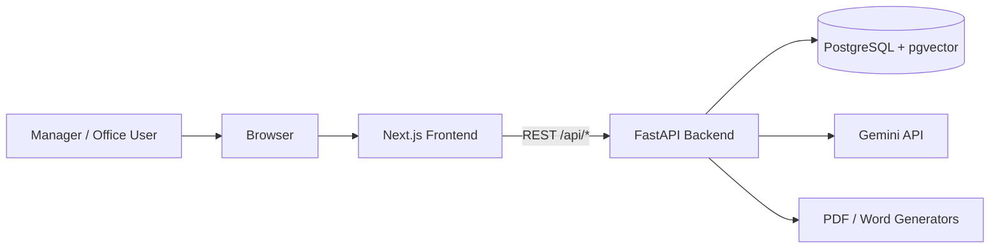
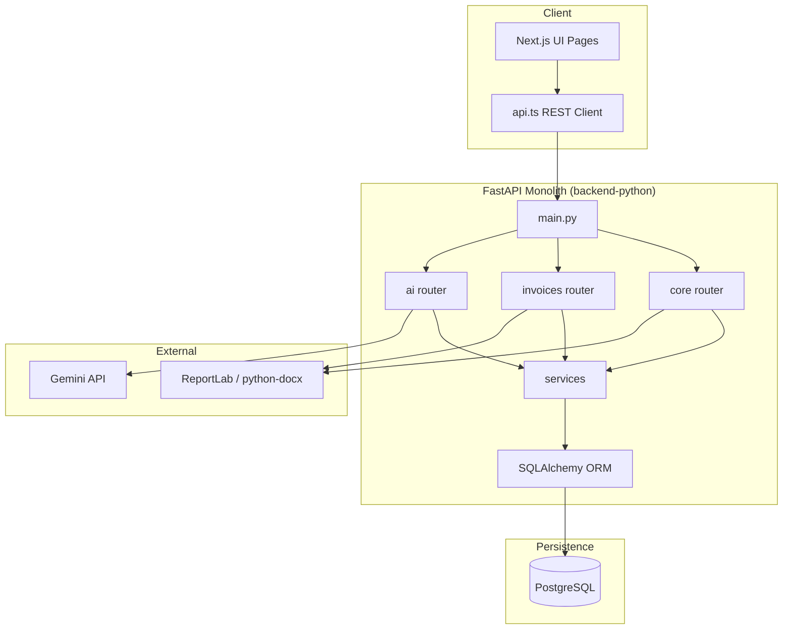
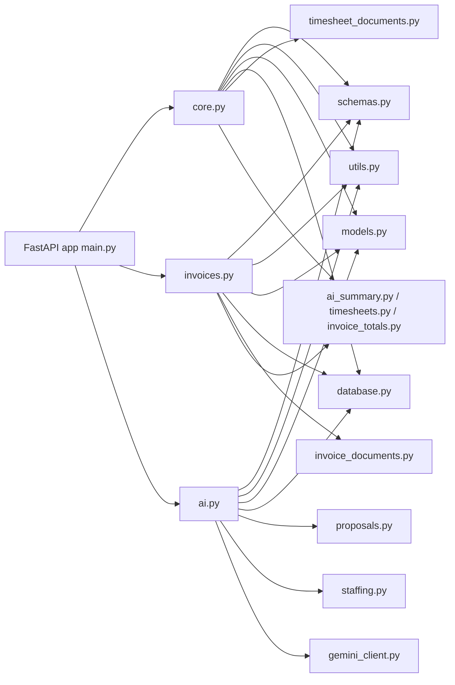
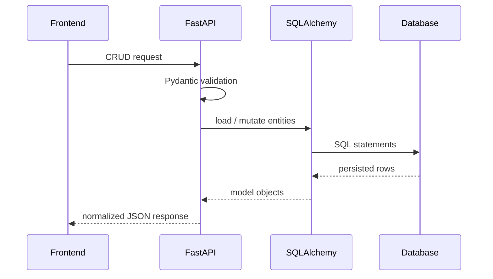
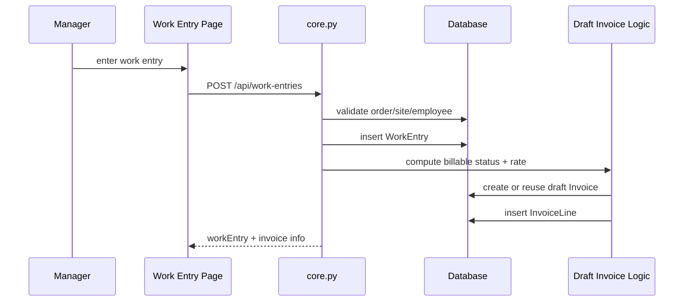
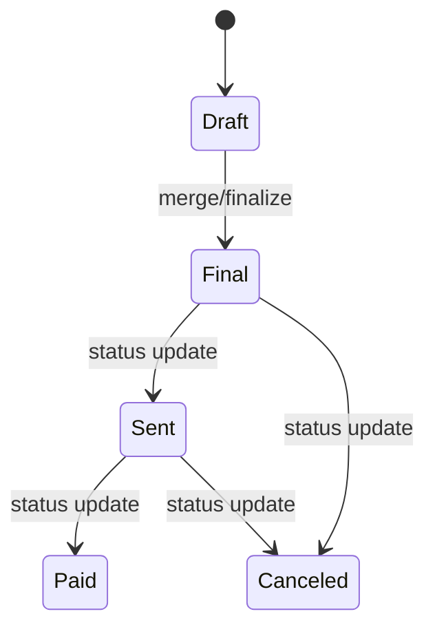
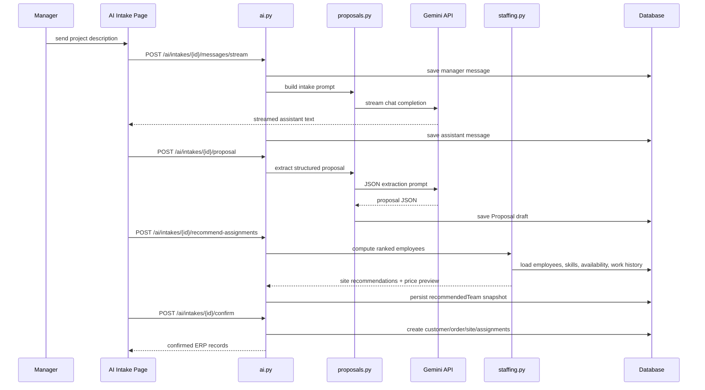
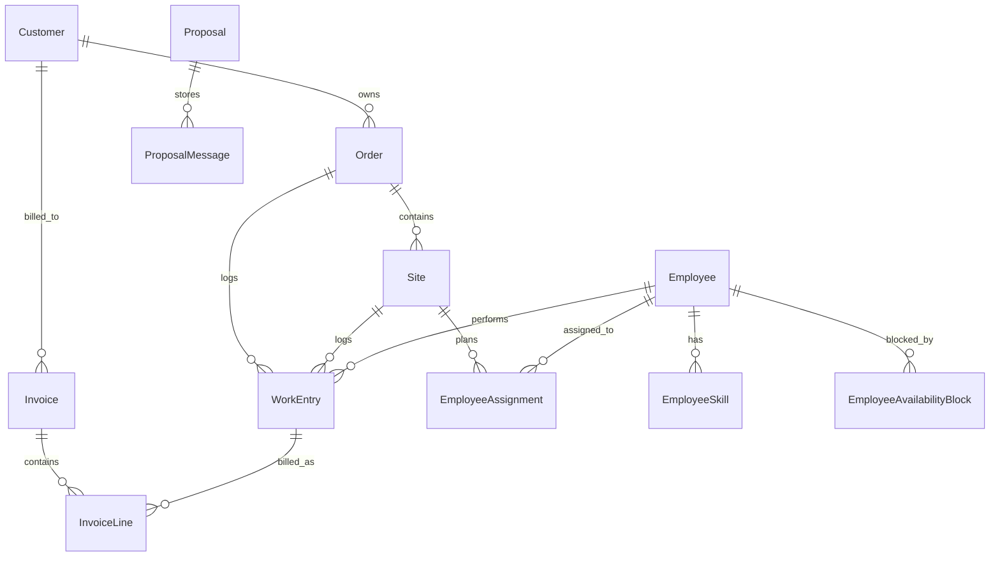
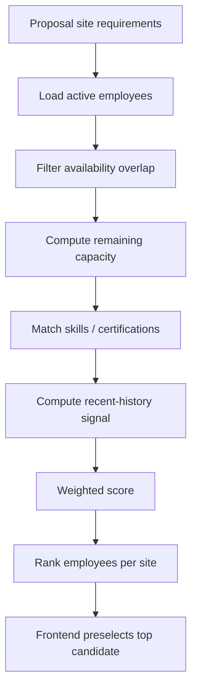

# Architecture Diagrams - Mini ERP

This file provides a cleaner Mermaid diagram set for the current active system.

## 1. System Context

## 2. Container View

## 3. Backend Component View

## 4. Core Business Flow

## 5. Work Entry to Draft Invoice Flow

## 6. Invoice Lifecycle

## 7. AI Intake Flow

## 8. Domain Relationships

## 9. Staffing Decision Model

