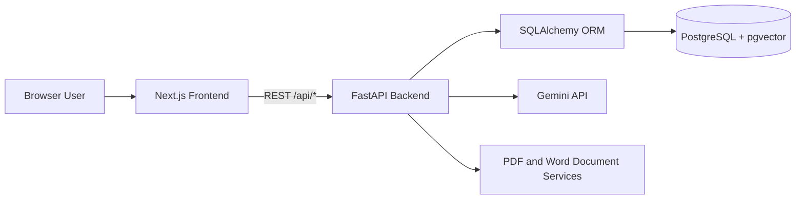
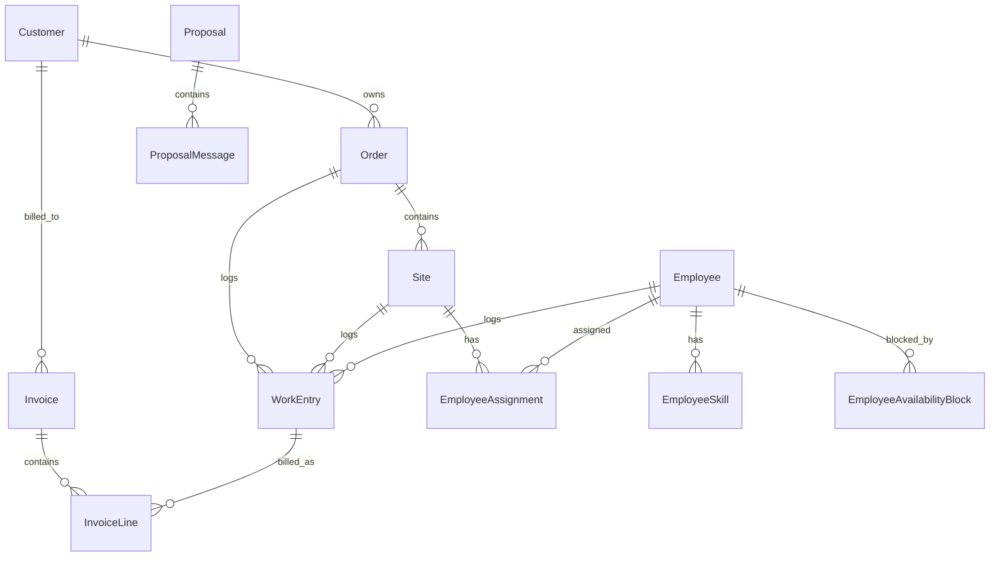
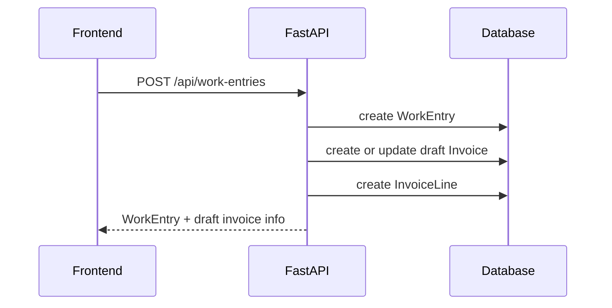
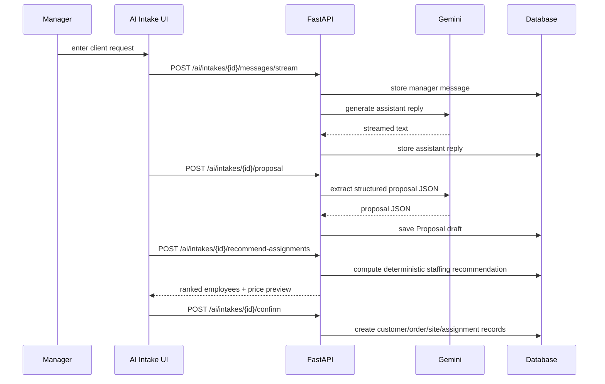

# Current-System Design - Mini ERP with AI Intake

Related documents:

- `docs/architecture-diagrams.md`
- `docs/future-target-architecture.md`

## 1. Overview

This project is a single-company ERP for a German renovation/construction business.

The active runtime architecture is:

- `frontend/` - Next.js App Router UI
- `backend-python/` - FastAPI monolith with SQLAlchemy
- PostgreSQL + pgvector database
- Gemini API - external AI provider used for intake chat and proposal drafting

The legacy `backend/` folder still exists in the repository, but the current active backend is `backend-python/`.

### Main design choice

All business truth lives in the FastAPI backend. The frontend is a client UI layer. Gemini is used only for intake understanding and proposal drafting. Staffing recommendations and final record creation stay deterministic and backend-controlled.

## 2. High-Level Architecture

### Frontend

- Tech: Next.js App Router
- Main role: forms, list/detail pages, document links, AI chat UI, staffing selection
- API access: `frontend/src/lib/api.ts`
- Main screens:
  - dashboard
  - customers
  - orders
  - sites
  - employees
  - work entries
  - invoice drafts
  - invoices
  - hour reports
  - AI intake

### Backend monolith

- Entrypoint: `backend-python/app/main.py`
- API modules:
  - `routers/core.py`
  - `routers/invoices.py`
  - `routers/ai.py`
- Shared responsibilities:
  - validation
  - business rules
  - DB persistence
  - invoice numbering
  - document generation
  - AI orchestration
  - staffing recommendation

### Persistence layer

- ORM: SQLAlchemy models in `backend-python/app/models.py`
- Database: PostgreSQL via `pg8000`
- Startup behavior:
  - create tables
  - apply lightweight compatibility fix for `weeklyCapacityHours`

### External dependencies

- Gemini API through `backend-python/app/services/gemini_client.py`
- ReportLab and python-docx for PDF and Word exports
- No background workers, queues, or async job processing

## 3. Core Domain Model

### Main entities

- `Customer`
  - company/contact master data
  - parent for orders and invoices
- `Order`
  - customer project container
  - owns sites and work entries
- `Site`
  - execution location within an order
- `Employee`
  - worker master record with hourly rate and capacity
- `EmployeeSkill`
  - skills and certifications
- `EmployeeAvailabilityBlock`
  - explicit unavailability windows
- `EmployeeAssignment`
  - employee-to-site planning assignment
- `WorkEntry`
  - actual logged work or absence
  - working entries drive draft invoice lines
- `Invoice` / `InvoiceLine`
  - draft, final, sent, paid, canceled billing state
- `Proposal` / `ProposalMessage`
  - AI intake transcript, extracted proposal draft, recommended team snapshot

## 4. Public API Surface

### Core ERP

- `/api/customers`
- `/api/employees`
- `/api/orders`
- `/api/sites`
- `/api/assignments`
- `/api/work-entries`
- `/api/reports/hours`
- `/api/settings/invoice-sequence`
- `/api/timesheets`
- `/api/timesheets/pdf`
- `/api/timesheets/word`

### Invoicing

- `/api/invoices`
- `/api/invoices/drafts/groups`
- `/api/invoices/drafts/group`
- `/api/invoices/merge`
- `/api/invoices/{id}/pdf`
- `/api/invoices/{id}/pdf/pauschal`
- `/api/invoices/{id}/word`
- `/api/invoices/{id}/word/pauschal`

### AI

- `/api/ai/work-summary`
- `/api/ai/intakes`
- `/api/ai/intakes/{id}`
- `/api/ai/intakes/{id}/messages/stream`
- `/api/ai/intakes/{id}/proposal`
- `/api/ai/intakes/{id}/recommend-assignments`
- `/api/ai/intakes/{id}/confirm`

## 5. Operational Data Flows

### CRUD flow

1. Frontend form submits JSON to FastAPI.
2. Backend validates payloads with Pydantic schemas.
3. SQLAlchemy persists entities.
4. Response is normalized into frontend-friendly JSON.

### Work-entry to invoice flow

Behavior:

- `work` day type creates invoice consequences
- `sick`, `vacation`, `holiday` do not create billable invoice lines
- updates and deletes are restricted when a work entry is already attached to non-draft billing state

### Invoice lifecycle

1. Work entries create multiple draft invoices.
2. Drafts are grouped by employee, site, or order.
3. User merges compatible drafts into a final invoice.
4. Export endpoints generate PDF or Word output on demand.

### AI intake flow

## 6. Staffing Recommendation Logic

Implementation: `backend-python/app/services/staffing.py`

Rules:

- only active employees are considered
- overlapping availability blocks exclude the employee
- remaining capacity is derived from:
  - `weeklyCapacityHours`
  - logged work entries in the proposal window
  - overlapping assignment pressure
- ranking weights:
  - skills/certification match
  - remaining capacity
  - recent work history

Current UX behavior:

- backend returns a ranked list for each site
- frontend auto-preselects the top ranked employee per site if no selection exists yet
- manager can override by selecting multiple employees per site before confirmation

## 7. Configuration and Runtime

### Required environment

Backend:

- `DATABASE_URL`
- `CORS_ORIGIN`
- `GEMINI_API_KEY`
- `GEMINI_MODEL`

Frontend:

- `NEXT_PUBLIC_API_BASE`

### Local runtime

- frontend: `http://localhost:3000`
- backend: `http://localhost:3001`
- health: `http://localhost:3001/api/health`

## 8. Constraints and Current Tradeoffs

- single-tenant design
- no authentication or authorization
- monolithic backend
- synchronous Gemini and document generation calls
- PostgreSQL is the single database runtime for local, test, and deployment use
- legacy TypeScript backend is still present in the repository, but current runtime design uses the Python backend
- AI is assistive only; final writes remain deterministic and manager-approved

## 9. Recommended Usage of This Design

Use this document as the reference for:

- onboarding engineers to the current active stack
- understanding where business rules live
- identifying integration points for new AI features
- planning future evolution toward auth, background jobs, or service decomposition
