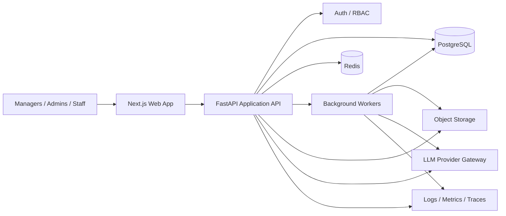
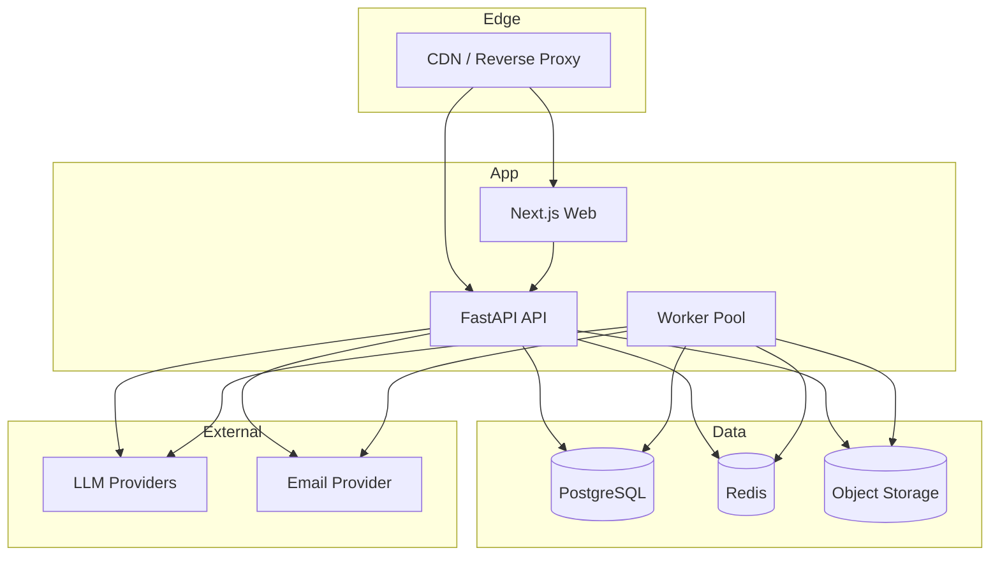

# Future Target Architecture - Mini ERP

This document describes the recommended target architecture for the next stage of the project. It is not the current implementation. It is the intended direction once the project moves beyond local-first, single-tenant usage.

## 1. Target Goals

The future architecture should improve:

- multi-user reliability
- secure access control
- long-running AI and document workflows
- operational observability
- deployment flexibility
- maintainability as features expand

## 2. Recommended Target Topology

## 3. Target Architecture Decisions

### Frontend

- keep Next.js as the main web client
- move more pages to typed API contracts and shared DTO definitions
- add authenticated sessions and role-aware navigation
- support async status indicators for AI jobs, exports, and imports

### Application backend

- keep one FastAPI application as the main system boundary
- maintain modular separation by domain:
  - master data
  - staffing
  - work logging
  - invoicing
  - AI intake
  - reporting
- add versioned internal service boundaries before considering microservices
- keep deterministic business logic in backend services, not in prompts

### Persistence

- move primary runtime to PostgreSQL
- keep SQLite only for local development and demos
- add proper migrations instead of startup compatibility patches
- add indexes for:
  - work-entry date filtering
  - invoice grouping
  - staffing lookups by active status and availability
  - proposal listing by updated timestamp

### Background execution

- move slow or variable-latency work out of request/response:
  - proposal extraction retries
  - document exports
  - OCR and import pipelines
  - notification sending
- use Redis-backed workers or equivalent queue system
- return job IDs and status endpoints to the frontend

### File and document storage

- move generated PDF and Word files to object storage
- persist metadata and file references in the DB
- support later addition of uploaded client documents for OCR and AI context

### AI integration

- put all LLM access behind a provider gateway abstraction
- support prompt versioning and model fallback
- log structured AI request metadata without storing secrets
- keep staffing and financial calculations deterministic
- allow future support for:
  - Gemini
  - OpenAI
  - OCR pipeline providers

### Security

- add authentication
- add role-based access control with at least:
  - admin
  - office manager
  - project manager
  - employee/read-limited roles if needed later
- restrict AI confirmation and invoice state changes to privileged roles
- validate and sanitize exported/generated document content

### Observability

- add structured logging
- add metrics for:
  - API latency
  - DB query timing
  - queue depth
  - AI call latency and error rate
  - document generation failures
- add request tracing across web, API, workers, and AI provider calls

## 4. Target Domain Flow Changes

### AI Intake

Future AI intake should become:

1. chat intake creation
2. transcript persistence
3. async proposal extraction job
4. async staffing plan generation
5. manager review and approval
6. deterministic ERP conversion
7. audit log of approval and resulting records

### Invoicing

Future invoicing should add:

- immutable invoice snapshots once finalized
- stronger invoice numbering guarantees under concurrency
- persisted export artifacts
- optional email delivery workflow

### Reporting

Future reporting should add:

- cached aggregates for heavier time windows
- exportable management reports
- optional materialized summary tables if volume grows

## 5. Recommended Deployment Shape

## 6. Migration Path from Current to Target

### Phase 1 - Stabilize the monolith

- keep FastAPI monolith
- standardize API schemas
- add auth and RBAC
- move fully to PostgreSQL for non-local environments
- replace startup schema patching with migrations

### Phase 2 - Introduce async infrastructure

- add Redis
- introduce worker queue
- move AI extraction and heavy document generation into jobs
- add status polling in the frontend

### Phase 3 - Add storage and observability

- add object storage for generated/exported files
- add structured logs, metrics, and tracing
- add audit logs for proposal confirmation and invoice transitions

### Phase 4 - Harden AI and integrations

- add provider abstraction for LLMs
- add prompt versioning
- add OCR/import pipeline
- add fallback handling and retry policies

## 7. Target Constraints and Non-Goals

- do not split into microservices early; keep one deployable backend until scale justifies separation
- do not let AI write accounting-critical data without explicit backend-controlled confirmation
- do not make SQLite the production target
- do not couple the frontend directly to provider-specific AI behavior

## 8. Recommended First Upgrades

The next practical upgrades should be:

1. authentication and role-based access control
2. PostgreSQL as the default non-local runtime
3. migration framework for schema evolution
4. Redis-backed background jobs for AI and exports
5. object storage for generated documents
